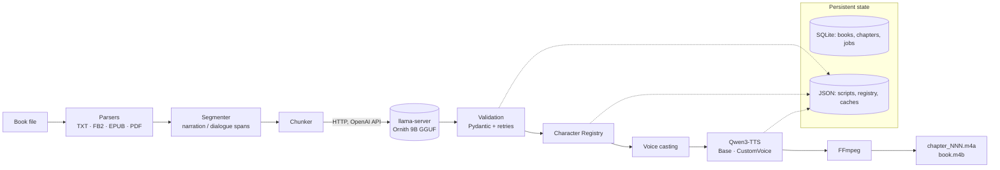

# AudioBooks

**Local AI audiobook generator.** Give it a book (TXT, EPUB, FB2, PDF) and it produces an
audiobook where a narrator reads the prose and recurring characters speak with their own,
stable voices – an "AI cast". Everything runs on your own machine: a local LLM
(Ornith 9B via llama.cpp) analyses who is speaking, Qwen3-TTS generates speech and FFmpeg
assembles chapters and an `.m4b`.

> Status: **MVP / experimental.** The full pipeline works end to end on a 6 GB laptop GPU
> (tested on an RTX 3050 with a Russian sample text), but it is young software. See
> [Known limitations](#known-limitations).

---

## Contents

1. [Current capabilities](#current-capabilities)
2. [Architecture](#architecture) and [pipeline](#pipeline)
3. [Hardware requirements](#hardware-requirements)
4. [Setup on Windows](#setup-on-windows) – Python, CUDA/PyTorch, llama.cpp + Ornith,
   Qwen3-TTS, FFmpeg, `.env`
5. [CLI usage](#cli-usage) · [API usage](#api-usage)
6. [Supported formats](#supported-book-formats) · [Voices](#voice-system) ·
   [Character Registry](#character-registry) · [SIMPLE vs AI CAST](#simple-vs-ai-cast)
7. [Output structure](#output-structure) · [Testing](#testing) ·
   [Known limitations](#known-limitations) · [Roadmap](#roadmap)

Further documentation: [`docs/ARCHITECTURE.md`](docs/ARCHITECTURE.md),
[`docs/VOICE_SYSTEM.md`](docs/VOICE_SYSTEM.md), [`docs/DEVELOPMENT.md`](docs/DEVELOPMENT.md).

## Current capabilities

| Feature | Status |
|---|---|
| Parse TXT (UTF-8/CP1251/…), FB2, FB2.ZIP, EPUB, PDF with text layer | **implemented** |
| Chapter detection (format structure, PDF bookmarks, "Глава 1"/"Chapter IV" headings, size fallback) | **implemented** |
| Narration/dialogue pre-segmentation (Russian dashes, quotes), sentence-safe splitting | **implemented** |
| Dialogue-aware chunking with context for speaker attribution | **implemented** |
| LLM labeling of spans: type, speaker, emotion; characters with gender/age/aliases | **implemented** (Ornith via llama-server) |
| Strict validation: JSON schema-constrained output, Pydantic, safe repair, retries | **implemented** |
| Persistent per-book Character Registry with cautious alias merging | **implemented** |
| Stable automatic voice casting + manual pinning | **implemented** |
| Qwen3-TTS: cloned voices (Base) and built-in speakers (CustomVoice) | **implemented** |
| Segment cache, resumable jobs (analysis per chunk, synthesis per segment) | **implemented** |
| FFmpeg assembly: pauses, loudness normalization, M4A/MP3 chapters, M4B with chapter markers | **implemented** |
| Automatic llama-server start/stop around analysis (frees VRAM for TTS) | **implemented** (opt-in) |
| CLI (`python -m audiobooks …`) | **implemented** |
| Local REST API (FastAPI) | **implemented** (minimal) |
| Emotion-driven TTS style | **experimental** – stored always, sent only to models that accept instructions |
| OCR of scanned PDF pages via Ornith + mmproj | **experimental** – interface and client implemented, not validated on real scans |
| Web UI, batched TTS, standalone image input, workers on other machines | **planned** |

## Architecture



The Python package (`src/audiobooks/`):

```
audiobooks/
    models/     Pydantic schemas (Book, Chapter, AudiobookSegment, Character, Voice, ProcessingJob)
    parsers/    TXT, PDF (PyMuPDF), EPUB (ebooklib + BeautifulSoup), FB2 (lxml, hardened)
    text/       segmenter (dialogue detection) and chunker
    llm/        LLMProvider protocol, OpenAI-compatible client, prompts, JSON repair, llama-server manager
    vision/     optional OCR boundary for image-only pages (experimental)
    voices/     voice library, Character Registry, casting
    tts/        TTSBackend protocol, Qwen3-TTS backend, fake backend for tests
    audio/      FFmpeg wrapper (argument lists only, no shell)
    storage/    SQLite repository and deterministic output layout
    services/   import, analysis, synthesis, assembly, pipeline orchestration
    cli/        Typer + Rich command line
    api/        FastAPI app
```

Core services do not depend on the CLI or FastAPI, and heavy ML libraries are imported
lazily only by the TTS backend.

### Pipeline

```
BOOK ──parse──► chapters ──segment──► spans ──chunk──► LLM labels (Ornith, llama-server)
                                                         │
                       llama-server stopped (if auto-managed) — VRAM freed
                                                         ▼
     Character Registry ──cast voices──► Qwen3-TTS (one model at a time) ──► segment WAVs
                                                         │
                       TTS model unloaded, torch.cuda.empty_cache()
                                                         ▼
                                FFmpeg ──► chapter_001.m4a … ──► <book>.m4b
```

Each stage persists its result, so an interrupted run continues where it stopped.

## Hardware requirements

| | Minimum tested | Notes |
|---|---|---|
| GPU | NVIDIA, 6 GB VRAM (RTX 3050 Laptop) | Ornith IQ4_XS needs ~5.5 GB with a 16k context; Qwen3-TTS 0.6B needs ~2 GB. **They never run at the same time.** |
| RAM | 16 GB (24 GB tested) | |
| Disk | ~12 GB | Ornith GGUF 5 GB + mmproj 0.9 GB, two Qwen3-TTS models 2.5 GB each, plus output |
| OS | Windows 10/11 | Linux/macOS should work (paths and subprocess calls are portable) but are untested |

Speed on the RTX 3050 6 GB (sample text): LLM analysis ≈ 20–35 s per chunk (~4000
characters per chunk by default); Qwen3-TTS generates roughly **1 second of audio per 3–4
seconds** of compute (no flash-attention on Windows). A 300-page novel is therefore an
overnight job – which is why everything is resumable.

## Setup on Windows

All commands are PowerShell, run from the project folder (here `C:\AI\reader`).

### 1. Python

Python 3.11+ (3.12 tested).

```powershell
cd C:\AI\reader
py -3.12 -m venv .venv          # skip if .venv already exists
.\.venv\Scripts\Activate.ps1
python -m pip install --upgrade pip
```

### 2. CUDA / PyTorch

Install a CUDA build of PyTorch **before** the project, matching your driver
(see <https://pytorch.org/get-started/locally/>). Example for CUDA 13.0:

```powershell
pip install torch torchaudio --index-url https://download.pytorch.org/whl/cu130
python -c "import torch; print(torch.__version__, torch.cuda.is_available())"
```

If PyTorch with CUDA already works in your venv, do not reinstall it – the project's
`tts` extra does not pin a torch version.

### 3. Project and Qwen3-TTS

```powershell
pip install -e ".[tts,api,dev]"
```

The Qwen3-TTS weights are downloaded from Hugging Face on first use into
`%USERPROFILE%\.cache\huggingface`:

* `Qwen/Qwen3-TTS-12Hz-0.6B-Base` (~2.5 GB) – cloned voices, used for the narrator;
* `Qwen/Qwen3-TTS-12Hz-0.6B-CustomVoice` (~2.5 GB) – nine built-in speakers for
  characters. Set `TTS_BUILTIN_VOICES=false` to never use (or download) it.

The warnings "SoX could not be found" and "flash-attn is not installed" printed by
`qwen-tts` are harmless.

### 4. llama.cpp and Ornith

1. Get a **CUDA** build of llama.cpp (`llama-server.exe`) from
   <https://github.com/ggml-org/llama.cpp/releases> (e.g. `llama-…-bin-win-cuda-12.4-x64.zip`
   plus the matching `cudart` zip). The winget package `ggml.llamacpp` may be CPU/Vulkan only.
2. Get the model from Hugging Face `protoLabsAI/Ornith-1.5-9B-MTP-GGUF`:
   `Ornith-1.5-9B-MTP-IQ4_XS.gguf` (~5.1 GB) and, only for the experimental OCR,
   `mmproj-Ornith-1.5-9B-BF16.gguf` (~0.9 GB). Keep them outside the repository.
3. Either start the server yourself:

   ```powershell
   llama-server.exe -m C:\models\Ornith-1.5-9B-MTP-IQ4_XS.gguf --host 127.0.0.1 --port 8081 `
       -c 16384 -ngl 99 -np 1 --jinja --alias ornith -fa on -ctk q8_0 -ctv q8_0
   ```

   **and stop it (Ctrl+C) before the synthesis stage** on a 6 GB GPU,

   or let AudioBooks manage it (recommended on small GPUs) with `LLM_AUTO_MANAGE=true`,
   `LLAMA_SERVER_EXE` and `LLAMA_MODEL_PATH` in `.env`: the server is started for
   analysis and stopped before TTS. A server that is already running on that port is used
   as-is and never stopped.

Any OpenAI-compatible endpoint works (`LLAMA_BASE_URL`, `LLAMA_MODEL`); Ornith is only the
default.

### 5. FFmpeg

```powershell
winget install Gyan.FFmpeg
```

Open a new terminal (PATH changes), or set `FFMPEG_PATH` in `.env` to the full path of
`ffmpeg.exe`. AudioBooks also looks in the winget package folder automatically.

### 6. `.env`

```powershell
Copy-Item .env.example .env
```

Most important settings (all documented in [`.env.example`](.env.example)):

| Variable | Default | Meaning |
|---|---|---|
| `LLAMA_BASE_URL` | `http://127.0.0.1:8081/v1` | OpenAI-compatible endpoint |
| `LLAMA_MODEL` | `ornith` | model name / server alias |
| `LLM_AUTO_MANAGE` | `false` | start/stop llama-server around analysis |
| `LLAMA_SERVER_EXE`, `LLAMA_MODEL_PATH` | – | needed for auto-manage |
| `LLAMA_CTX_SIZE`, `LLAMA_SERVER_EXTRA_ARGS` | `16384`, empty | server tuning |
| `TTS_BACKEND` | `qwen` | `fake` = test tones, no GPU |
| `TTS_MODEL`, `TTS_CUSTOM_VOICE_MODEL` | Qwen3-TTS 0.6B Base / CustomVoice | |
| `TTS_DEVICE`, `TTS_DTYPE` | `cuda:0`, `bfloat16` | |
| `TTS_LANGUAGE` | `auto` | from the book's language, or e.g. `Russian` |
| `NARRATOR_VOICE` | `narrator_01` | voice id from the library |
| `CHUNK_MAX_CHARS` | `4000` | text per LLM request |
| `OUTPUT_DIR`, `DATA_DIR`, `VOICE_LIBRARY_DIR` | `output`, `data`, `voices` | |
| `AUDIO_FORMAT` | `m4a` | or `mp3` |

Check everything:

```powershell
python -m audiobooks doctor
```

## CLI usage

```powershell
# look at a book without importing it
python -m audiobooks inspect input\book.epub

# AI CAST: analyze -> cast -> synthesize -> chapters + .m4b
python -m audiobooks generate input\book.fb2 --mode cast

# SIMPLE: one narrator, no LLM needed
python -m audiobooks generate input\book.txt --mode simple

# only some chapters, no .m4b
python -m audiobooks generate input\book.epub --chapters 1-3 --no-m4b

# analysis only (scripts + Character Registry + casting), then review before synthesis
python -m audiobooks analyze input\book.epub
python -m audiobooks characters <book-id>
python -m audiobooks characters <book-id> --assign anna=female_01

# continue an interrupted job (ids are printed when a job starts)
python -m audiobooks resume <job-id>

# books, chapters, jobs
python -m audiobooks status
python -m audiobooks status <book-id>

# voices
python -m audiobooks voices list
python -m audiobooks voices add female_01 clip.wav --text "Exact transcript." --gender female

# local API
python -m audiobooks serve --port 8000
```

`generate`/`analyze` accept either a file path (imported on first use; importing the same
file again maps to the same book) or a book id. Add `-v` for debug logging.

Typical workflow on a 6 GB GPU without auto-manage:

```powershell
# terminal 1: start llama-server (see above)
python -m audiobooks analyze input\book.fb2        # terminal 2
# stop llama-server in terminal 1 (Ctrl+C), then:
python -m audiobooks generate input\book.fb2       # reuses the analysis, only synthesizes
```

## API usage

`python -m audiobooks serve` starts FastAPI on `http://127.0.0.1:8000`
(interactive docs at `/docs`). Jobs run one at a time on a background worker.

| Method | Path | |
|---|---|---|
| GET | `/health` | status, available voices |
| POST | `/books` | multipart upload (`file`), returns the book |
| GET | `/books`, `/books/{id}` | list / details incl. chapters and jobs |
| POST | `/books/{id}/analyze` | `{"chapters": [1,2], "heuristic": false}` → job |
| POST | `/books/{id}/generate` | `{"mode": "cast", "chapters": null, "build_m4b": true}` → job |
| GET | `/books/{id}/characters` | Character Registry |
| PUT | `/books/{id}/characters/{cid}/voice` | `{"voice_id": "female_01"}` pins a voice |
| GET | `/books/{id}/chapters` | chapter state |
| GET | `/books/{id}/chapters/{n}/script` | structured segments |
| GET | `/books/{id}/chapters/{n}/audio`, `/books/{id}/audiobook` | download audio |
| GET | `/jobs/{id}`, POST `/jobs/{id}/resume` | job progress / resume |
| GET | `/voices` | voice library |

```powershell
curl.exe -F "file=@input/book.txt" http://127.0.0.1:8000/books
curl.exe -X POST -H "Content-Type: application/json" -d '{\"mode\":\"cast\"}' `
    http://127.0.0.1:8000/books/<book-id>/generate
curl.exe http://127.0.0.1:8000/jobs/<job-id>
```

The API is meant for localhost (no authentication). Uploads are type- and size-checked,
file names are sanitized and the original upload is deleted after import.

## Supported book formats

| Format | Chapters from | Notes |
|---|---|---|
| `.txt` | headings ("Глава 1", "ГЛАВА ПЕРВАЯ", "Chapter IV", "Пролог", roman numerals) or ~20k-char parts | UTF-8/UTF-16/CP1251 detection, hard-wrapped lines joined |
| `.fb2`, `.fb2.zip` | `<section>` tree (nested titles joined: "Часть 1. Глава 2") | notes bodies skipped; XML parsed without entity expansion |
| `.epub` | spine documents, split at `h1`–`h3`, TOC titles | covers/tiny documents merged |
| `.pdf` | top-level bookmarks, else headings | text layer only; image-only pages are reported and skipped unless `VISION_ENABLED=true` (experimental OCR via Ornith + mmproj) |

Book content is only ever parsed as data – never executed.

## Voice system

Voices live in `voices/metadata/*.json` (committed) with optional recordings in
`voices/references/` (never committed).

* **Cloned voices** (`source: reference`) use Qwen3-TTS Base with a 10–20 s reference
  recording and its exact transcript. `narrator_01` is the default narrator – put your
  recording at `voices/references/narrator_01.wav` and its transcript in
  `voices/metadata/narrator_01.json`.
* **Built-in voices** (`source: builtin`) are the nine speakers of Qwen3-TTS CustomVoice
  (`qwen_ryan`, `qwen_serena`, …). No recording needed; they speak Russian with an accent.

Use only recordings you have the right to clone. Details, metadata format and legal notes:
[`docs/VOICE_SYSTEM.md`](docs/VOICE_SYSTEM.md).

## Character Registry

Every book has `output/<book-id>/character_registry.json`: the characters the LLM found,
their aliases, gender, age group, description, line count and **assigned voice**.

* The LLM is shown the known characters in every request and asked to reuse their ids.
* Aliases are merged only on strong evidence (reused id, explicit `same_as`, or a unique
  exact name match with compatible gender). Uncertain matches stay separate and are listed
  in `possibly_same_as` – never merged silently.
* A character's voice is assigned once (best gender/age match, main characters first,
  spreading voices) and then never changes, so "Анна" sounds the same in chapter 1 and 30.
* Dialogue the LLM cannot attribute gets the speaker `unknown` (read by the narrator or
  `UNKNOWN_SPEAKER_VOICE`) instead of a guessed character.
* You can edit the file or pin voices with `characters <book-id> --assign id=voice`;
  only affected segments are re-rendered.

## SIMPLE vs AI CAST

| | SIMPLE (`--mode simple`) | AI CAST (`--mode cast`, default) |
|---|---|---|
| LLM | not needed (typographic segmentation only); `--llm` to analyse anyway | required |
| Voices | narrator voice for everything | narrator + one persistent voice per character |
| GPU | TTS only | LLM, then TTS (sequentially) |
| Use for | quick listening, low VRAM, books without dialogue | the full "AI cast" experience |

Both modes use the same segmentation, so audio of narrator segments is shared between
them through the cache.

## Output structure

```
output/
    <book-id>/                      e.g. voina-i-mir-1a2b3c4d
        metadata.json               book + per-chapter state (human-readable)
        book.json                   parsed text cache
        character_registry.json
        source/<original file>
        script/
            chapter_001.json        validated segments: type, speaker, emotion, original text
        analysis/
            chapter_001/chunk_0001.json   cached LLM responses (resume)
        audio/
            chapter_001/
                segment_0001.wav
                segment_0002.wav
                manifest.json       cache keys, voices, durations
            chapter_001.m4a
        <book-id>.m4b               all chapters with chapter markers
data/
    audiobooks.sqlite3              books, chapters, jobs
    logs/llama-server.log           when auto-managed
```

A script segment looks like:

```json
{"index": 2, "type": "dialogue", "speaker": "anna", "text": "Ты всё-таки пришёл?",
 "emotion": "whisper", "paragraph": 1}
```

## Testing

```powershell
ruff check .
pytest
```

The suite (≈80 tests) covers parsers (TXT/FB2/EPUB/PDF), segmentation and chunking,
registry persistence and voice stability, malformed LLM JSON and retries, FFmpeg command
construction, SQLite storage, the API, and full pipeline runs with fake LLM/TTS
providers including resume and caching. It never downloads models or needs a GPU; FFmpeg
tests run when FFmpeg is installed. Real-model smoke tests are opt-in:

```powershell
$env:AUDIOBOOKS_REAL_MODELS = "1"; pytest tests/test_real_models.py -s
```

More in [`docs/DEVELOPMENT.md`](docs/DEVELOPMENT.md).

## Known limitations

* **Speed.** Qwen3-TTS 0.6B on a laptop GPU is ~3–4× slower than real time; segments are
  synthesized one by one (no batching yet).
* **Voice variety.** Out of the box there is one cloned voice (narrator, recording
  supplied locally) plus nine built-in Qwen speakers that are not native Russian
  speakers. Better casts need more legally obtained reference recordings.
* **Emotion** is detected and stored but barely influences cloned voices (Qwen3-TTS Base
  has no style instruction input).
* **Attribution quality** depends on the LLM. Ornith handles explicit speech tags well;
  long untagged exchanges can still produce `unknown` or wrong speakers. Chunks are
  analyzed sequentially; there is no second pass to reconcile the whole book.
* **Dialogue detection** is typographic: books that mark dialogue unusually (e.g. no dashes
  or quotes) rely entirely on the LLM correcting the hints.
* **Scanned PDFs / images:** OCR via Ornith + mmproj is implemented as an interface but not
  validated; image files are not accepted as input yet.
* **Editing the source** (or parser changes) re-analyzes the affected chapter; audio is
  reused by content, but the LLM may label it slightly differently.
* The API has no authentication and a single in-process worker – localhost only.
* Tested on Windows 11 with an RTX 3050 6 GB only.

## Roadmap

* Batched TTS generation and a faster attention backend.
* Voice design: generate reference voices from descriptions instead of recordings.
* Whole-book speaker reconciliation pass; UI to review/merge `possibly_same_as` characters.
* Emotion/style control with instruction-capable TTS models.
* Validated OCR path for scanned PDFs and image input.
* Web UI (Next.js) on top of the existing API; remote LLM/TTS workers.
* Pronunciation dictionary (stress marks for Russian names).
