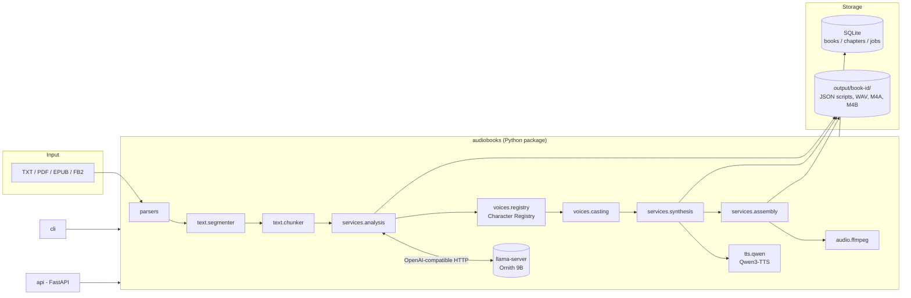

# Architecture

AudioBooks is a local pipeline that turns a book file into a multi-voice audiobook.
It is designed around one hard constraint: **a 6 GB GPU cannot hold the LLM and the TTS
model at the same time**. Every heavy stage therefore runs on its own, releases its GPU
memory, and leaves its results on disk so the next stage (or a later run) can continue.

## Components



| Package | Responsibility | Depends on |
|---|---|---|
| `models` | Pydantic schemas: book, chapter, segment, character, voice, job | – |
| `parsers` | File → `ParsedBook` (chapters + paragraphs). No AI. | PyMuPDF, ebooklib, lxml |
| `text` | `segmenter` splits paragraphs into narration/dialogue spans; `chunker` packs spans into LLM-sized chunks | – |
| `llm` | `LLMProvider` protocol, OpenAI-compatible client, prompts, JSON repair, llama-server lifecycle | httpx |
| `vision` | Optional OCR boundary for image-only pages (experimental) | llm.client |
| `voices` | Voice library, Character Registry, casting | – |
| `tts` | `TTSBackend` protocol, Qwen3-TTS backend, fake backend | torch, qwen-tts (lazy) |
| `audio` | FFmpeg command builders + runner | ffmpeg binary |
| `storage` | SQLite repository, deterministic output layout | sqlite3 |
| `services` | Use cases: import, analysis, synthesis, assembly, pipeline orchestration | everything above |
| `cli`, `api` | Thin front ends over `services`; `api/static/index.html` is a dependency-free web page over the API | typer/rich, FastAPI |

Core services never import FastAPI or Typer. Heavy libraries (`torch`, `qwen_tts`) are
imported lazily inside the TTS backend, so parsing, analysis and tests work without them.

## Data flow

1. **Import** (`BookService.import_book`): the file is validated, hashed, parsed and
   copied to `output/<book-id>/source/`. The parsed text is cached as `book.json`;
   books and chapters are registered in SQLite. Importing the same file again is a no-op
   (the id is `<title-slug>-<sha256[:8]>`).
2. **Segmentation** (`text.segmenter`): each paragraph is split into spans using
   typography (Russian dialogue dashes `— …, — сказал он.`, quotes). Long spans are split
   at sentence boundaries (`SEGMENT_MAX_CHARS`). The real chapter title becomes the first
   span, so it is announced.
3. **Analysis** (`services.analysis`):
   * *heuristic* (SIMPLE mode): spans become segments directly; dialogue speaker is
     `unknown`.
   * *llm* (AI CAST mode): spans are packed into chunks (`CHUNK_MAX_CHARS`) that never cut
     a paragraph and prefer to end after narration, so dialogue exchanges stay together.
     Each chunk is sent with: the previous paragraphs as read-only context, the known
     characters from the registry, and the most recent speakers. The LLM returns *labels
     only* (`type`, `speaker`, `emotion` per span id) plus character observations.
4. **Registry update + casting** (`voices.registry`, `voices.casting`).
5. **Synthesis** (`services.synthesis`): each segment → voice id → WAV.
6. **Assembly** (`services.assembly`): FFmpeg concatenates segments with pauses into a
   chapter file and finally an `.m4b` with chapter markers.

### Why the LLM labels instead of rewriting

The LLM never returns text. The text that reaches TTS is always the original span from
the segmenter, so the author's prose cannot be paraphrased, translated or truncated by
the model. A label referring to an unknown span id is dropped; spans the LLM forgets
(≤20 %) fall back to the heuristic label; a response that misses more is rejected and
retried.

## LLM responsibilities and validation

`OpenAICompatibleProvider.analyze_chunk`:

1. sends a system prompt (`llm/prompts.py`, versioned by `PROMPT_VERSION`) and the chunk;
2. requests grammar-constrained JSON (`response_format: json_schema`) and disables the
   model's thinking phase (`chat_template_kwargs.enable_thinking=false`);
3. extracts JSON safely (`json_repair.py`: strips `<think>` blocks and code fences, cuts the
   outermost object, removes trailing commas – it never invents content);
4. validates with Pydantic (`ChunkAnalysis`), normalizes enums (e.g. `quiet` → `whisper`);
5. on failure retries with a stricter message that includes the error; after
   `LLAMA_MAX_RETRIES` it raises `LLMResponseError`. Nothing is written for a failed chunk.

The provider is an interface (`llm/base.py`): replacing Ornith with another
OpenAI-compatible server is a configuration change; replacing the protocol means adding
one class.

## Character Registry

`output/<book-id>/character_registry.json` – one per book, human-editable.

```json
{
  "book_id": "voina-i-mir-1a2b3c4d",
  "characters": {
    "anna": {
      "id": "anna", "name": "Анна", "aliases": ["Аня", "Анна Сергеевна"],
      "gender": "female", "age_group": "young_adult",
      "description": "...", "voice_id": "qwen_serena", "voice_locked": false,
      "possibly_same_as": [], "first_chapter": 1, "line_count": 42
    }
  }
}
```

Merge rules (`CharacterRegistry.observe`):

* `same_as` pointing at a known id → merge.
* The LLM reused a known id → merge, unless the genders contradict.
* A name/alias matches exactly **one** known character (case-, `ё`-insensitive) with a
  compatible gender → merge.
* Otherwise a new character is created. Ambiguous matches and the LLM's
  `possibly_same_as` are recorded, **never silently merged**.

Re-applying the same observation (e.g. from a cached chunk on resume) is idempotent.

Casting (`VoiceCaster`) gives each new character the best available voice by gender
(strong), age (weak) and current usage (spreads voices), main characters first. Once a
character has a voice it is never re-cast, so the voice is stable for the whole book and
across runs. Users can pin voices (`voice_locked`).

## Persistence

| What | Where | Why |
|---|---|---|
| books, chapters, jobs, progress | SQLite `data/audiobooks.sqlite3` | queryable state, safe concurrent access from CLI/API |
| parsed text | `output/<id>/book.json` | parse once |
| per-chunk LLM results | `output/<id>/analysis/chapter_NNN/chunk_NNNN.json` | resume mid-chapter; keyed by prompt version + model + text |
| chapter scripts | `output/<id>/script/chapter_NNN.json` | readable/editable structured audiobook data |
| Character Registry | `output/<id>/character_registry.json` | human-editable voice assignments |
| segment audio | `output/<id>/audio/chapter_NNN/segment_NNNN.wav` + `manifest.json` | content-addressed cache |
| chapter audio | `output/<id>/audio/chapter_NNN.m4a` + `assembly.json` | skip re-encoding when unchanged |

All JSON writes are atomic (temp file + rename). The SQLite repository (`storage/db.py`)
exposes plain Pydantic models; a PostgreSQL implementation would only need the same
methods.

### Caching and resume

* A chapter script is reused when its `source_hash` (chapter text + segment settings)
  matches and its analysis method satisfies the request (LLM scripts also satisfy SIMPLE
  mode).
* A segment WAV is reused when its manifest key matches:
  `sha256(text, voice fingerprint incl. reference-audio hash, TTS model, language, emotion if used)`.
* A chapter file is re-encoded only when the list of segment keys, pauses or audio
  settings changed.
* `resume <job-id>` simply runs the job again.

## GPU lifecycle

```
analysis   llama-server (Ornith ~5.5 GB VRAM)   ── stopped if LLM_AUTO_MANAGE=true
casting    CPU only
synthesis  Qwen3-TTS Base  (~2 GB)  ── unloaded ─┐  segments are sorted by model,
           Qwen3-TTS CustomVoice (~2 GB) ────────┘  so each model loads at most once
           close(): del model, gc.collect(), torch.cuda.empty_cache()
assembly   FFmpeg (CPU)
```

* The TTS model is loaded once per synthesis stage, never per segment; voice-clone
  prompts are built once per voice and cached.
* Before loading TTS, free VRAM is checked; a warning explains that llama-server is
  probably still running.
* With `LLM_AUTO_MANAGE=false` (default) AudioBooks never touches an external
  llama-server: stop it yourself before synthesis on small GPUs (see README).

## Future worker architecture

The stages already communicate only through files + SQLite and the
`LLMProvider` / `TTSBackend` protocols are injected via `AppContext` factories. Moving to
workers means:

* an LLM worker that runs analysis jobs (or simply a remote `LLAMA_BASE_URL`);
* a TTS worker exposing `synthesize(SynthesisRequest) -> AudioClip` over HTTP, plugged in
  as another `TTSBackend`;
* replacing the single-thread `JobRunner` in the API with a queue (e.g. a `jobs` table
  poller) and moving `output/` to shared storage.
